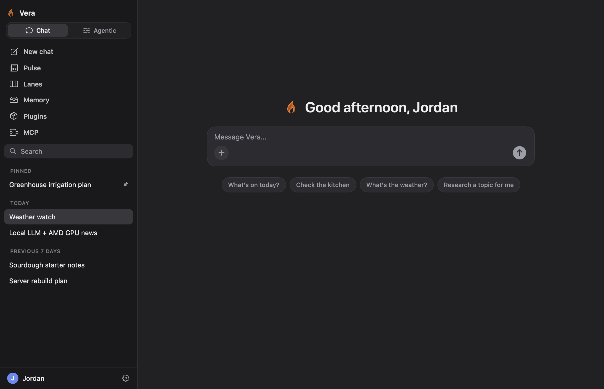
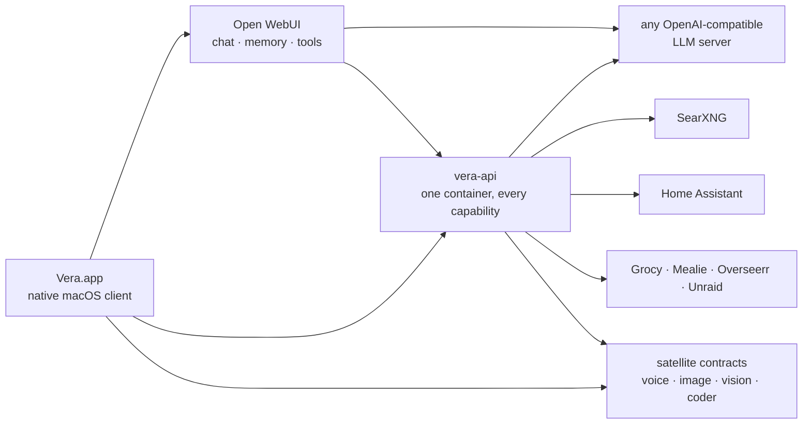
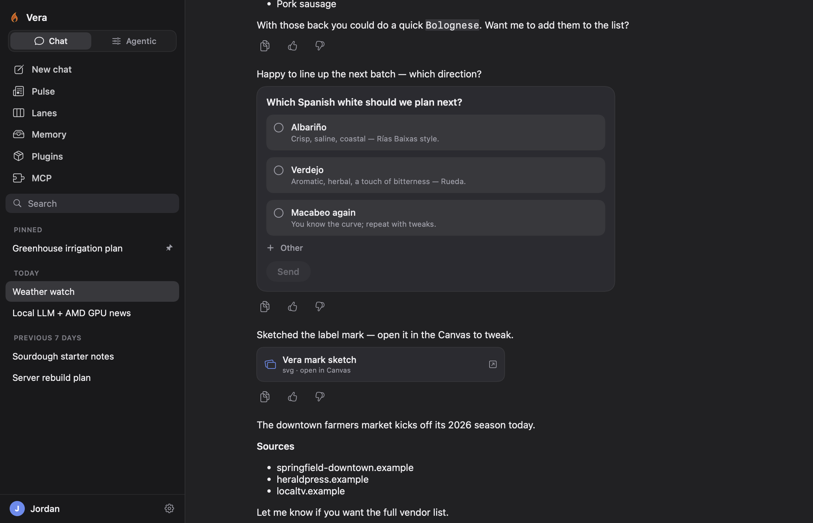
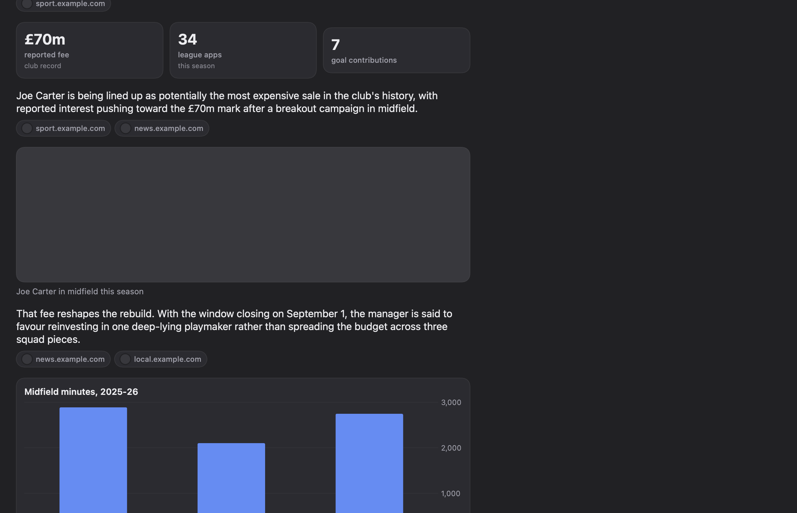
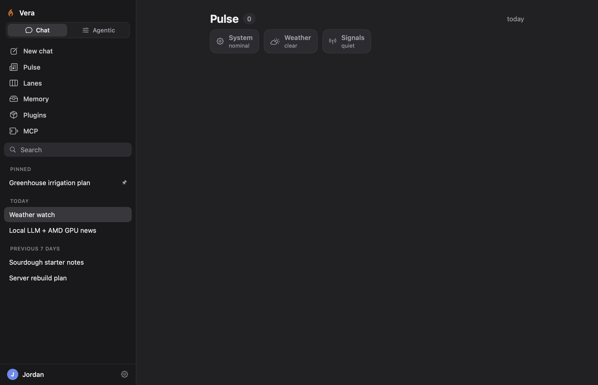
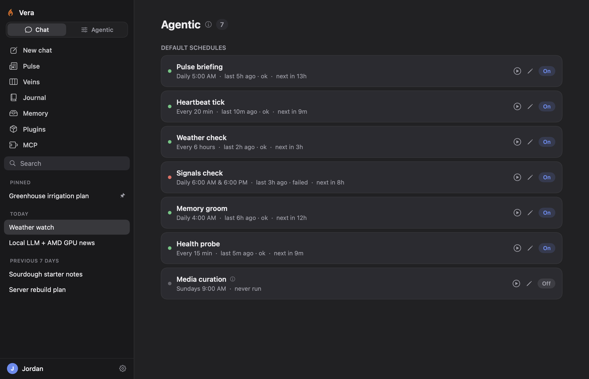
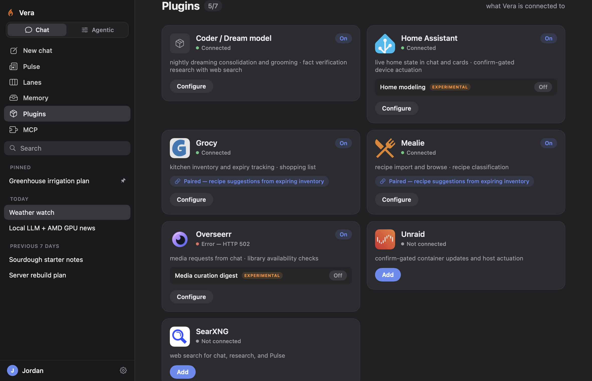
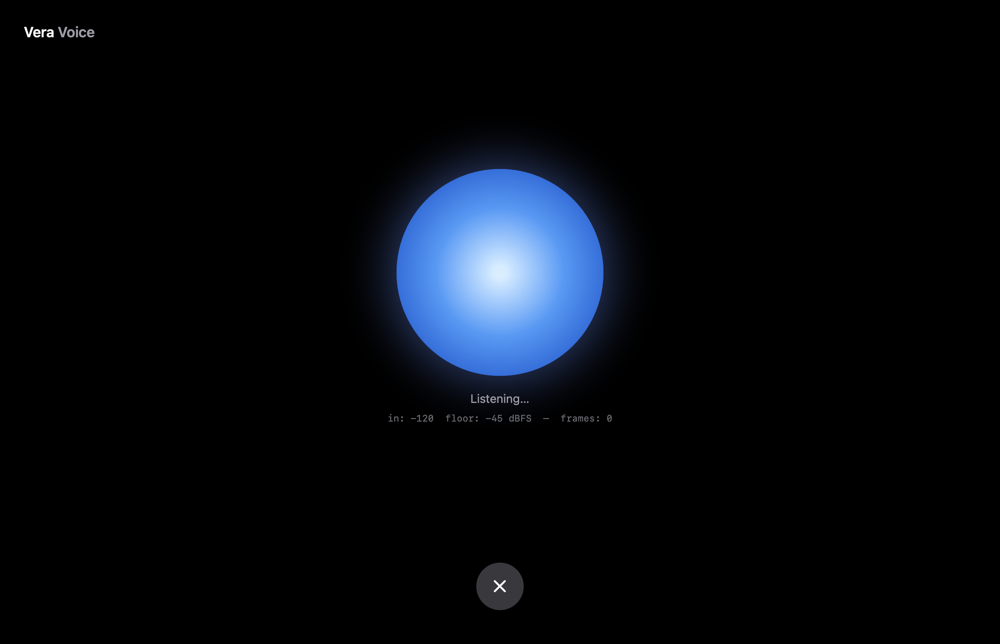
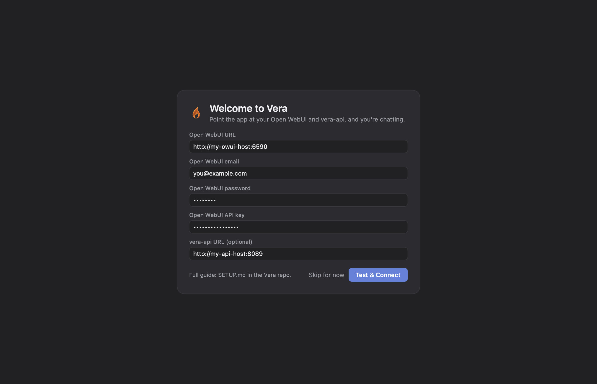

<div align="center">

# Vera

**A self-hosted AI assistant for your home.**

[](LICENSE)
[](apps/vera-mac)
[](services/vera-api)
[](services/vera-api)
[](apps/vera-mac)

[Setup](docs/SETUP.md) · [Contributing](CONTRIBUTING.md)



</div>

---

Vera is a self-hosted personal AI assistant: scheduled research briefings, opt-in ambient monitoring, persistent memory, local voice, and Home Assistant integration, running entirely on your own hardware with no cloud dependency.

All endpoints, model servers, thresholds, and behavioral defaults are configuration — nothing is hardcoded — and every capability degrades gracefully when its dependencies are unconfigured.

## Architecture

Three components, connected by URLs:

- **[Open WebUI](https://github.com/open-webui/open-webui)** — conversations, memory, and tool execution, against any OpenAI-compatible model server.
- **vera-api** (optional) — a single FastAPI service that lights up the ambient and experimental surfaces; each capability is one router: research briefings, ambient watch veins, home intelligence, kitchen inventory, memory grooming, a scheduler, and a typed confirm-before-acting actuation layer. The app is complete without it; connecting its URL adds these surfaces.
- **Vera.app** — a native SwiftUI macOS client: chat, the Pulse feed, veins, memory curation, integrations, and voice.



Run everything on one machine or spread it across several — topology is configuration. There are no hardcoded hosts in the tree, and the startup config report shows exactly what is wired.

## Features

### Chat — tools, artifacts, structured answers

Conversations run through Open WebUI's pipeline, so every tool and memory applies. Replies can carry interactive choice cards, stat blocks and charts, citations, and canvas artifacts.

<div align="center"></div>

### Pulse — scheduled research briefings

Vera researches overnight — topics drawn from her own accumulating interests and what the household actually asks about — and produces briefing cards with cited sources, inline statistics, and charts. Any card can be continued as a chat.

<div align="center"></div>

### Veins — opt-in ambient monitoring

A row of status chips above the feed — System, Weather, Signals, Media — each an independently configured monitor that stays quiet until a configured threshold is crossed. **None are enabled by default.** Each vein is scoped: the Signals vein can watch only financial stress indicators; the System vein can monitor only Home Assistant. Thresholds determine what surfaces; the model only explains what crossed them.

<div align="center"></div>

### Journal — her standing commitments, as a live graph view

When a monitored situation deserves follow-through (a signals event, or simply "keep an eye on lumber prices for me"), Vera lands it as a watch in her Profile Graph, the same memory the rest of Pulse ranks from. The Journal is a live view over those watch and project nodes: each shows what she is watching, why it matters, what would resolve it, and when to check next. A repeat of a known situation folds onto its existing node by vector similarity instead of piling up, so the list cannot run away; a watch retires only when its resolve condition and date are both met. The app renders the view read-only at `GET /journal`, and Pulse surfaces a card when a watched node materially changes. You steer it by talking to her: hand her a new watch and it becomes a node, ask what she is keeping an eye on, or have her let one go.

### Agentic — the autonomy control room

The Agentic tab opens on a living canvas: every flow Vera runs on her own — briefings, weather, signals, grooming, health probes, the heartbeat — drawn as a node graph connected to the surfaces it feeds, served by the API as a manifest (`GET /agentic/graph`) so new capabilities appear on the canvas without an app update. Running flows glow, outcomes tint their nodes, recent events travel their edges, and a node that used a tool carries a badge naming it on hover. Clicking a flow opens an inspector with run-now, enable/disable, and plain-English schedule editing; flows with internal stages (the Pulse pipeline, the heartbeat's branches) drill into their own maps with per-stage state from the last run. All of it rides the built-in scheduler: a job tied to a vein or integration does not fire until that vein or integration is enabled, and gated jobs report why they are not running.

Everything Vera does on her own is also auditable in one place: an Activity feed (`GET /agentic/activity`) merges heartbeat outcomes, scheduled job runs, and autonomous actions into a single newest-first list, rendered as the Activity pane of the Agentic tab. Autonomy is wanted, and it is always visible.

<div align="center"></div>

### Integrations — configured from the app

Each integration is a card: enter a URL and key, test, enable. Enabling an integration activates the capability across the stack, including the Open WebUI tool wiring. Experimental features (whole-house behavior modeling, media curation) require explicit consent and state exactly what they do before they can be enabled.

<div align="center"></div>

### Memory, voice, and home control

Vera maintains an inspectable, editable memory store and grooms it nightly — every change reversible and surfaced as an audit card. A local voice service provides STT/TTS. With Home Assistant connected, Vera answers from live home state and acts through a typed, confirmation-gated action system; nothing in the home actuates without an explicit confirmation. Trust is graduated per verb: an action explicitly enrolled as autonomous — which the registry permits only for low-risk, trivially reversible verbs — executes without a confirmation and surfaces afterward as a System card. Exactly one verb is enrolled: recipe import, so Vera can save a recipe she finds worth keeping into the household cookbook on her own, capped, deduplicated, and announced after the fact.

<div align="center"></div>

## The endpoint matrix

Every external dependency is a configuration slot with defined behavior when empty:

| Slot | Contract | Powers | When absent |
|---|---|---|---|
| Main LLM | OpenAI `/v1` | Everything generated | Nothing generates; API surfaces still serve |
| Open WebUI | OWUI API | Chat, memory, promoted cards, self-authored skills | Chat features off; Pulse still researches |
| SearXNG | `/search` JSON | Research, signals news, image sourcing | Search-dependent features report unconfigured |
| Dream/coder LLM | OpenAI `/v1` + tool calls | Nightly consolidation, fact verification | Dreaming skips; daily features unaffected |
| Image gen | OpenAI Images API | Pulse cover art | Cards use the best researched image instead |
| Vision | OpenAI chat + `image_url` | Image understanding in chat | Vision tools report unconfigured |
| Voice | Wyoming + small HTTP API | Hands-free voice mode | Voice UI disabled |
| Playwright | run-server websocket | Full-page renders for research | Falls back to snippets |

| Integration | Powers | When absent |
|---|---|---|
| Home Assistant | Live home state, actuation, System-vein sources | Home features off |
| Grocy / Mealie | Kitchen inventory, expiry, recipes (pairing unlocks suggestions) | Kitchen tools off |
| Overseerr | Media requests, weekly curation digest (consent-gated) | Media vein unavailable |
| Unraid | Container updates, host actuation | Those update sources drop from System |
| Apple Reminders | Reminders lists read/write from chat, shared lists included (hosted by the Mac app, or the headless EventKit bridge, on a Mac signed into iCloud) | Reminders tools off |
| FRED / EIA keys | Credit-spread and grid-stress signals | Those collectors skip cleanly |

<details>
<summary><b>Example deployment</b></summary>

<br>

One Linux server runs Open WebUI, vera-api, SearXNG, and an RTX 3090 serving the main model via llama-swap. A Mac Studio runs the MLX satellite services (image generation, vision, the dream/coder model) on demand, and a Mac mini runs voice and the Apple Reminders bridge. A single capable machine can run the entire stack, and any component can be replaced by a hosted equivalent by changing one URL.

</details>

## Quick start

**Backend** (any Docker host — pulls the released image from GHCR):

```sh
git clone https://github.com/DisplacedForest/vera.git && cd vera
cp .env.example .env     # fill in your LLM + OWUI endpoints; everything else is optional
docker compose up -d
docker compose logs vera-api | head -60    # the config report — what's wired, what's not
```

**App** (macOS 26+; earlier macOS can run releases up to 0.2.x): download `Vera.app.zip` from the [latest release](https://github.com/DisplacedForest/vera/releases/latest), unzip, drag to Applications. The app is ad-hoc signed, so the first launch needs right-click → Open.

**Backend without Docker** (macOS arm64): each release also ships `vera-api-macos-arm64.zip`, a self-contained engine binary — verify the checksum, unzip, run; data lands in `~/.vera/data` (see `docs/SETUP.md`).

Building either from source instead:

```sh
docker compose up -d --build        # backend (uncomment `build:` in docker-compose.yml)
cd apps/vera-mac && scripts/deploy.sh   # app — packages Vera.app and installs it to /Applications
```

Onboarding asks for your endpoints, then offers the opt-in veins (managed anytime from the Pulse header); integrations are configured anytime from the Settings window.

<div align="center"></div>

The full walkthrough, including Open WebUI wiring and every integration: **[docs/SETUP.md](docs/SETUP.md)**.

## Constraints

- The reference satellite services (voice, image, vision, coder) are MLX-based and require Apple Silicon. Each implements a documented HTTP contract (OpenAI Images, OpenAI chat, Wyoming) that any compatible service can satisfy — the contracts are the interface; the references are one implementation.
- The native app is macOS-only (14+). The backend runs anywhere Docker runs.
- Vera is built for a single household, not multi-tenancy.

## Contributing

Issues and PRs are welcome; merged work is credited in the next release's notes. See [CONTRIBUTING.md](CONTRIBUTING.md) for the conventions: everything parameterized, live data only, graceful degradation, one capability per router.

## License

[MIT](LICENSE).
