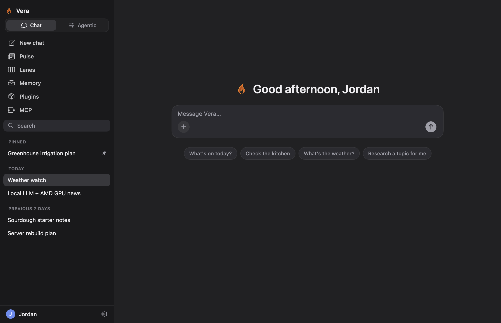
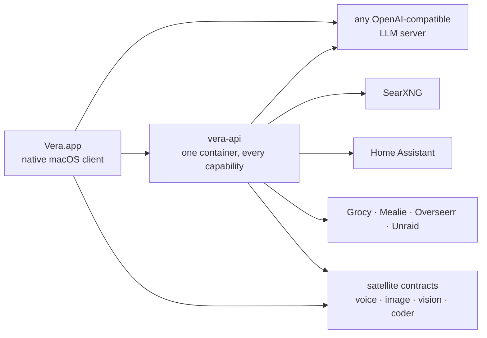
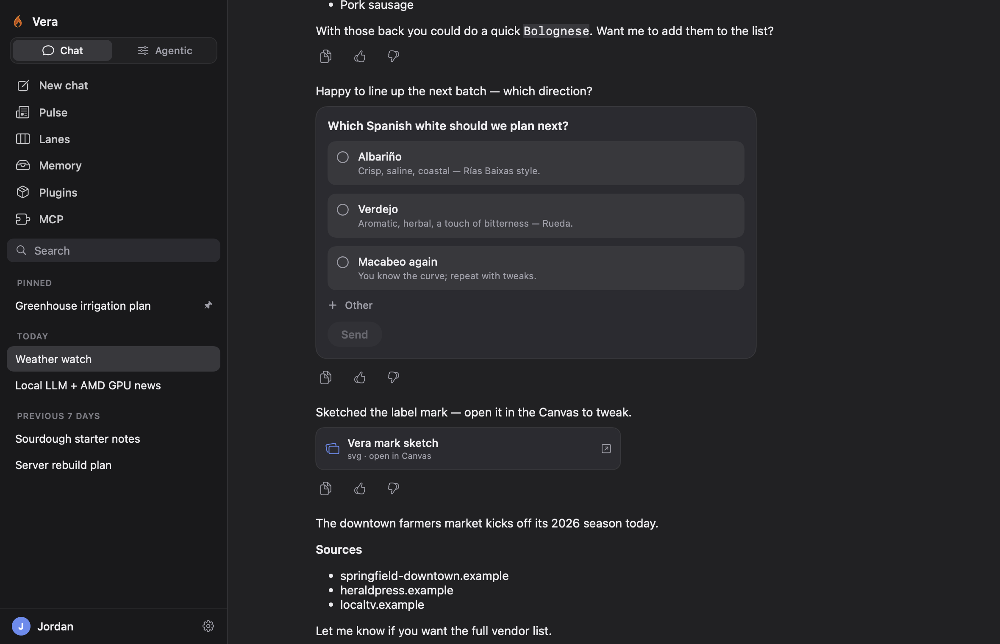
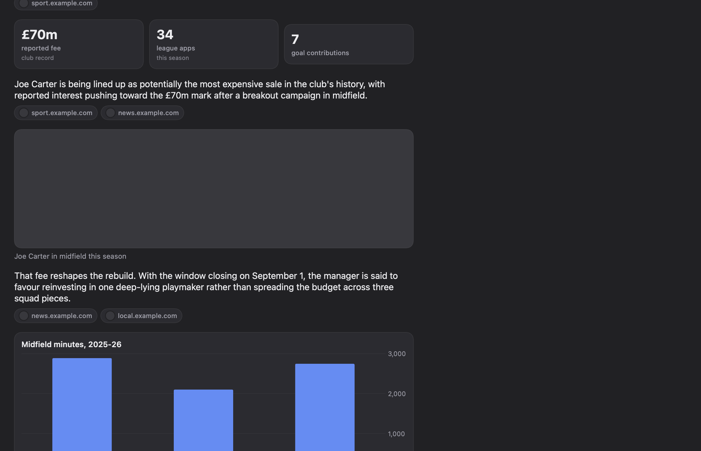
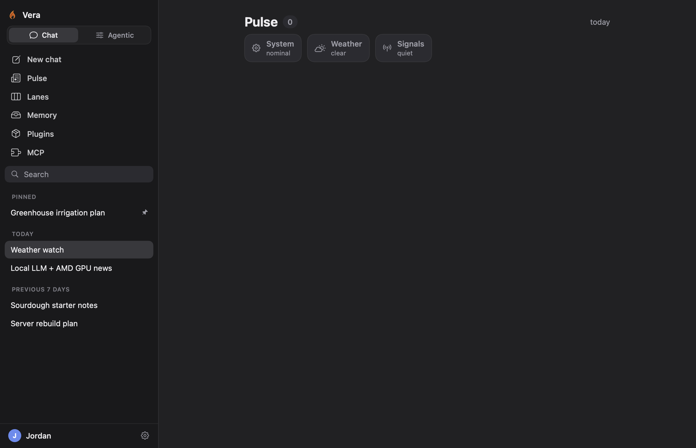
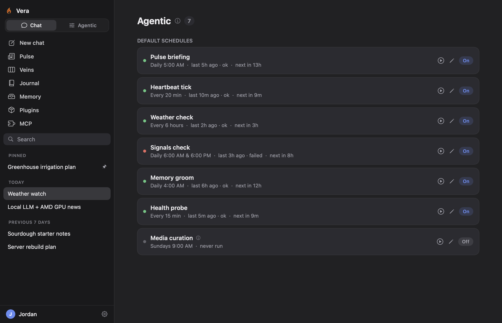
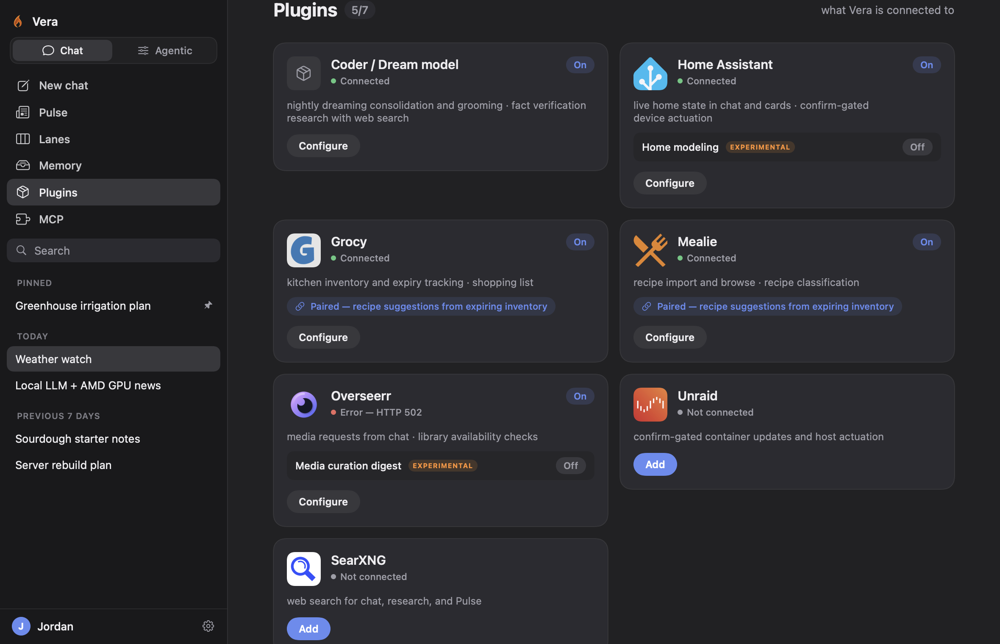
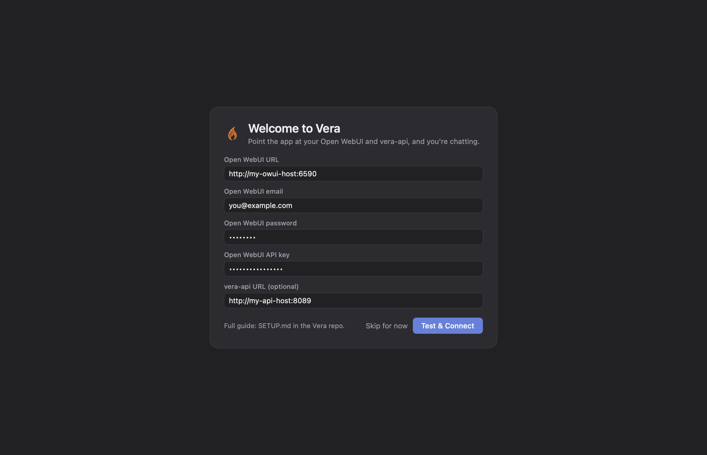

<div align="center">

# Vera

**A self-hosted AI assistant for your home.**

[](LICENSE)
[](apps/vera-mac)
[](services/vera-api)
[](services/vera-api)
[](apps/vera-mac)

[Setup](docs/SETUP.md) · [Contributing](CONTRIBUTING.md)



</div>

---

Vera is a self-hosted personal AI assistant: scheduled research briefings, opt-in ambient monitoring, persistent memory, local voice, and Home Assistant integration, running entirely on your own hardware with no cloud dependency.

All endpoints, model servers, thresholds, and behavioral defaults are configuration: nothing is hardcoded: and every capability degrades gracefully when its dependencies are unconfigured.

## Architecture

Three components, connected by URLs:

- **An OpenAI-compatible model endpoint**: native text chat connects directly to its `/v1` API and keeps conversation history on the Mac.
- **vera-api** (optional): a single FastAPI service that lights up the ambient and experimental surfaces; each capability is one router: research briefings, ambient watch veins, home intelligence, kitchen inventory, document knowledge collections with retrieval, memory grooming, a scheduler, and a typed confirm-before-acting actuation layer. The app is complete without it; connecting its URL adds these surfaces.
- **Vera.app**: a native SwiftUI macOS client: chat, the Pulse feed, veins, memory curation, integrations, and voice.


```mermaid
flowchart LR
    APP["Vera.app<br/>native macOS client"]
    LLM["any OpenAI-compatible<br/>LLM server"]
    API["vera-api<br/>one container, every capability"]
    SEARX["SearXNG"]
    HA["Home Assistant"]
    INT["Grocy · Mealie · Overseerr · Unraid"]
    SAT["satellite contracts<br/>voice · image · vision · coder"]

    APP --> LLM
    APP --> API
    API --> LLM
    API --> SEARX
    API --> HA
    API --> INT
    API --> SAT
    APP --> SAT
```

Run everything on one machine or spread it across several: topology is configuration. There are no hardcoded hosts in the tree, and the startup config report shows exactly what is wired.

## Features

### Chat: native, streaming, and local

Text chat streams directly from the selected saved OpenAI-compatible endpoint. Settings lists every model identifier returned by discovery, shows which model is selected and why, keeps the last successful model list for offline reference, and preserves the selection across relaunches. Conversations, messages, and inspected tool activity live in `~/.vera/vera.sqlite`, so chat works without vera-api. Each request's system context is assembled at send time in a fixed order: a compact shipped policy block, the active persona, user context, per-conversation instructions, the current date, time, and owner name, any recalled memory facts, and usage contracts for exactly the tools and presentation formats available to the selected model. Disabling a tool or switching to a model without tool support removes its instructions from the next request.

A native prompt library manages personas, user context, and reusable prompts in the local database with revision history, exact restore, markdown import and export, and a request preview that shows the read-only policy block above the user-authored sections. The previous single system prompt appears as the default persona after upgrade with no user action, and reusable prompts insert into the composer as message text rather than system text.

Native chat uses the standard OpenAI Chat Completions `tools` and streamed `tool_calls` fields. It validates names and JSON arguments before local execution, returns ordinary `tool` messages to the model, and continues until the model sends its final answer. The loop stops after four tool rounds or eight calls. Each executor has a 20-second deadline unless a tool declares its own. Limits, denials, timeouts, and failures retain received text and activity. Apple Reminders is the first built-in. It is disabled by default, requests macOS permission when deliberately enabled in Settings, Tools, and supports explicit chat requests to list, create, and complete reminders. Web search and deep research are built-ins too, riding the configured vera-api URL: search answers from live results, and research runs a long multi-step pass (up to five minutes on its own deadline) that returns a cited report rendered with inline citation chips and a numbered sources row, persisted with the conversation. Both stay disabled by default and show an unconfigured hint until a vera-api URL is set. The separate Settings, Plugins switch controls optional legacy service wiring and does not expose a native chat tool. Each call appears as a live expandable chip and remains with the conversation after relaunch. Endpoints without standard tool calling continue as text chat and receive no private text protocol. Voice, additional native tools, and MCP remain separate work; chat history starts fresh on a native install by design.

Additional tools are config, not code: drop a JSON declaration in `~/.vera/tools.d/` and the app loads it as a native chat tool alongside the built-ins, complete with its own Settings toggle, model-facing description, and confirmation policy. The app bundles a few declarations this way: an actions surface, skill authoring, and a recurring-watch author over vera-api routes, all of which light up once the vera-api base URL is configured. Anyone can add their own by pointing a declaration at any HTTP endpoint, such as a home inventory service reachable at `http://inventory.example:8090/items`.

Image attachments are native and local. Pick, drop, or paste png, jpeg, heic, webp, or gif images into the composer; each one is validated against a 20 MB cap, stored under the app's Application Support directory, and kept with its conversation across relaunches. Attached images go to the configured model endpoint as standard OpenAI-compatible `image_url` content parts, encoded inline, and to nowhere else. Local, remote, and Pulse media render natively, and anything that fails to load shows a placeholder instead of a broken layout.

Attachment routing is deterministic and disclosed. Every model carries a capability profile (image input, tool calls, streaming, an images-per-request limit) resolved from a small bundled name-pattern table of known vision families, and every field can be overridden per model in Settings, Model. Before each send the profile decides the route: a vision-capable model receives the image directly; a text-only model with a configured vision bridge (any separate OpenAI-compatible vision endpoint) gets the bridge's description of the image as clearly labeled context, never the image itself, with the route and full description visible on the turn; a text-only model with no bridge produces an explicit choice to send without the attachment or cancel. Nothing is sent silently, and a bridge failure keeps the message and attachment saved locally without contacting the model.

Advanced model controls live in Settings, Model behind a collapsed Advanced section, so ordinary setup never sees them. Every parameter is a typed declaration with a range, a scope, and a plain-language explanation: sampling (temperature, top p, top k, seed, penalties), tokens and stops, reasoning mode and effort, a streaming toggle, and a client-side context-length ceiling. Controls the selected model's capability profile cannot honor are disabled with the reason stated, overrides are stored per endpoint profile and model, and anything left at its endpoint default is omitted from the request entirely, so an untouched install sends exactly the same payload as before. A typed key-value editor covers provider-specific knobs through the chat template kwargs object, a per-request trace shows the final resolved parameter set actually sent, and when an endpoint rejects a parameter the app names it and offers a one-tap reset that retries without losing the message.

Native personal memory is an optional, local-only Mac feature. It starts off, stores approved readable facts beside local chat history, retrieves only relevant approved and unexpired facts within fixed budgets, and places every generated create, update, merge, suppression, expiry, or deletion in a review queue. Approved episodic facts are removed automatically once their expiry date has passed, each removal recorded in the audit trail. The Memory Library organizes items as **You**, **Topics**, **Areas**, and **People**. Personal memory has no server dependencies; everything lives in the app's local store. See [Native memory](docs/NATIVE_MEMORY.md).

<div align="center"></div>

### Knowledge: document collections that ground chat

The Knowledge area manages document collections stored in vera-api's document engine: create and describe collections, add txt, md, pdf, docx, or html files, watch each file's index state (pending, indexing, ready, failed with the reason, stale), search and sort within a collection, and reindex or remove files. Any chat can then ground itself on selected collections: each turn retrieves the most relevant passages, the reply cites them inline, and the sources row names the collection and file behind every citation. Retrieval status is always visible (searching, how many passages, none relevant, or unavailable). Knowledge is an API-backed surface like Pulse: without a vera-api URL the area shows a clean unconfigured state and chat shows no knowledge controls, and nothing retrieved ever writes into personal memory automatically.

### Pulse: scheduled research briefings

Vera researches overnight: topics drawn from her own accumulating interests and what the household actually asks about: and produces briefing cards with cited sources, inline statistics, and charts. Pulse remains an optional vera-api surface. Continue in chat turns a card into a durable native conversation: the card's text, citations, and provenance are copied into the local database as the first message, so the conversation opens and survives even after the card expires or vera-api goes away. Creating that first continuation is the only step that needs vera-api reachable; each card maps to one local conversation, and continuing again reopens it. Remote card images are not cached locally and fall back to the existing placeholders when their source disappears.

<div align="center"></div>

### Veins: opt-in ambient monitoring

A row of status chips above the feed, one per vein: each an independently configured monitor that stays quiet until a configured threshold is crossed. **Vera ships with none**: a vein is something you build for your own life. A river gauge, a service-status watch, a geopolitics bar: describe what deserves an ambient eye and the in-app builder turns the conversation into a schema-validated JSON definition with a block pipeline (search, fetch, threshold math, LLM judge/compose) and a schedule; dropping a definition file in place works too. Thresholds determine what surfaces; the model only explains what crossed them, one card per distinct situation, updated rather than stacked. Veins are portable files: export one and you get a `.vein.json` scrubbed of deployment specifics, import one and it lands disabled for review, so a monitor you build is a file anyone can drop into their own Vera.

The third way to author a vein is to just ask. Tell Vera in chat to keep an eye on something ("keep an eye on lumber prices for me") and the recurring-watch tool drafts one: the same schema-validated definition the builder produces, presented in plain language with what would run and how often. Agree and the definition lands in the deployment's `veins.d`, enabled and scheduled like any other vein; decline and nothing is saved. Authoring is explicit chat only: no ambient, scheduled, or autonomous path ever proposes or saves one.

<div align="center"></div>

### Agentic: the autonomy control room

The Agentic tab opens on a living canvas: every flow Vera runs on her own: briefings, vein runs, grooming: drawn as a node graph connected to the surfaces it feeds, served by the API as a manifest (`GET /agentic/graph`) so new capabilities appear on the canvas without an app update. Running flows glow, outcomes tint their nodes, recent events travel their edges, and a node that used a tool carries a badge naming it on hover. All of it rides the built-in scheduler: a job tied to a vein or integration does not fire until that vein or integration is enabled, and gated jobs report why they are not running.

The map and the editor are two zoom levels of one surface: clicking any flow opens it in the same workflow editor. Every flow is served as a workflow definition through the same endpoints (`GET /agentic/workflows/{id}` and its catalog), with a Schedule trigger at the head reflecting the flow's real schedule: scheduled code-backed flows project their steps, veins project their block pipelines, and Pulse serves its stored graph. Opening a flow turns the existing app sidebar into a searchable node library and dedicates the main workspace to the connected workflow and selected-node inspector. The library, each node's configuration fields, and the graph rules all come from the server's catalog, so a node type registered server-side appears in the palette with editable, schema-rendered settings without an app update.

Each flow carries a served profile that decides what editing it allows. Pulse's profile permits structural editing: nodes can be added, wired, configured, and arranged in a draft; the server's validation verdict decides when a draft can be saved or promoted, and the published flow stays unchanged until that draft is explicitly promoted. Code-backed flows carry a locked profile: their graphs render, pan, and inspect like any other, structural affordances are simply absent, and the server rejects structural edits; settings each node's schema declares (starting with the schedule on its trigger) stay editable through the same draft and promote path. Every workflow starts with a trigger node configured in plain schedule fields that map to the built-in scheduler, so what starts a flow is visible and editable right on the canvas. A schedule set outside those fields (a server env override, a custom cron) renders as server-managed instead of masquerading as an editable default.

The same canvas also replays results: a Run toggle overlays the latest recorded run on the graph, tinting each node by how it finished and captioning it with its output count and duration. Selecting a node in run mode swaps the inspector to what that node actually recorded (input, output, timing, state, and any error) and the visual review nodes show their per-card evidence, cover image, verdict, and retry. Run mode is read-only over recorded runs; with no run recorded yet it says so instead of inventing one.

Everything Vera does on her own is also auditable in one place: an Activity feed (`GET /agentic/activity`) merges scheduled job runs and autonomous actions into a single newest-first list, rendered as the Activity pane of the Agentic tab. Autonomy is wanted, and it is always visible.

<div align="center"></div>

### Integrations: configured from the app

Each integration is a card: enter a URL and key, test, enable. Enabling an integration activates the capability across the stack. Experimental features (whole-house behavior modeling, media curation) require explicit consent and state exactly what they do before they can be enabled.

<div align="center"></div>

### Memory, voice, and home control

Vera maintains an inspectable, editable memory store and grooms it nightly: every change reversible and surfaced as an audit card. A local voice service provides STT/TTS. With Home Assistant connected, Vera answers from live home state and acts through a typed, confirmation-gated action system; nothing in the home actuates without an explicit confirmation. Trust is graduated per verb: an action explicitly enrolled as autonomous: which the registry permits only for low-risk, trivially reversible verbs: executes without a confirmation and surfaces afterward as a System card. Exactly one verb is enrolled: recipe import, so Vera can save a recipe she finds worth keeping into the household cookbook on her own, capped, deduplicated, and announced after the fact.

<div align="center"></div>

## The endpoint matrix

Every external dependency is a configuration slot with defined behavior when empty:

| Slot | Contract | Powers | When absent |
|---|---|---|---|
| Main LLM | OpenAI `/v1` | Native text chat and configured generation | Chat reports unconfigured; API surfaces still serve |
| SearXNG | `/search` JSON | Research, watcher veins, image sourcing | Search-dependent features report unconfigured |
| Coder LLM | OpenAI `/v1` + tool calls | Cross-model claim auditing, fact verification | Audits fall back to the main model; daily features unaffected |
| Image gen | OpenAI Images API | Pulse cover art | Cards use the best researched image instead |
| Vision | OpenAI chat + `image_url` | Image understanding in chat | Vision tools report unconfigured |
| Voice | Wyoming + small HTTP API | Hands-free voice mode | Voice UI disabled |
| Playwright | run-server websocket | Full-page renders for research | Falls back to snippets |
| Embeddings | OpenAI `/v1/embeddings` | Document knowledge indexing and retrieval, Pulse novelty ranking | Collections stay manageable; indexing and retrieval report unconfigured |

| Integration | Powers | When absent |
|---|---|---|
| Home Assistant | Live home state, actuation, the `ha_state` vein block | Home features off |
| Grocy / Mealie | Kitchen inventory, expiry, recipes (pairing unlocks suggestions) | Kitchen tools off |
| Overseerr | Media requests, weekly curation digest (consent-gated) | Media curation unavailable |
| Unraid | Container updates, host actuation | Those update sources drop from update digests |
| Apple Reminders | Reminders lists read/write from chat, shared lists included (hosted by the Mac app, or the headless EventKit bridge, on a Mac signed into iCloud) | Reminders tools off |

<details>
<summary><b>Example deployment</b></summary>

<br>

One Linux server runs vera-api, SearXNG, and an RTX 3090 serving the main model via llama-swap. A Mac Studio runs the MLX satellite services (image generation, vision, the coder model) on demand, and a Mac mini runs voice and the Apple Reminders bridge. A single capable machine can run the entire stack, and any component can be replaced by a hosted equivalent by changing one URL.

</details>

## Quick start

**Backend** (any Docker host: pulls the released image from GHCR):

```sh
git clone https://github.com/DisplacedForest/vera.git && cd vera
cp .env.example .env     # fill in the backend services you use; everything is optional
docker compose up -d
docker compose logs vera-api | head -60    # the config report: what's wired, what's not
```

**App** (macOS 26+; earlier macOS can run releases up to 0.2.x): download `Vera.app.zip` from the [latest release](https://github.com/DisplacedForest/vera/releases/latest), unzip, drag to Applications. The app is ad-hoc signed, so the first launch needs right-click → Open.

**Backend without Docker** (macOS arm64): each release also ships `vera-api-macos-arm64.zip`, a self-contained engine binary: verify the checksum, unzip, run; data lands in `~/.vera/data` (see `docs/SETUP.md`).

**Backend on the Mac, app-managed** (macOS arm64): in the app, Settings, Services, Engine, **On this Mac** downloads and runs that same engine as a checksum-verified background service on `127.0.0.1`, points the app at it, and keeps it in step with app updates. No Docker and no terminal (see `docs/SETUP.md`).

Building either from source instead:

```sh
docker compose up -d --build        # backend (uncomment `build:` in docker-compose.yml)
cd apps/vera-mac && scripts/deploy.sh   # app: packages Vera.app and installs it to /Applications
```

Onboarding walks through a friendly endpoint name, an OpenAI-compatible URL ending in `/v1`, an optional key saved in the Mac keychain, explicit model discovery and selection, the system prompt, optional local memory, and the native tool picker. The guide is skippable and can be resumed from Settings without touching chat history. vera-api remains optional and independently powers Pulse and the other ambient surfaces.

<div align="center"></div>

The full walkthrough, including native chat and every integration: **[docs/SETUP.md](docs/SETUP.md)**.

## Constraints

- The reference satellite services (voice, image, vision, coder) are MLX-based and require Apple Silicon. Each implements a documented HTTP contract (OpenAI Images, OpenAI chat, Wyoming) that any compatible service can satisfy: the contracts are the interface; the references are one implementation.
- The native app is macOS-only (14+). The backend runs anywhere Docker runs.
- Vera is built for a single household, not multi-tenancy.

## Contributing

Issues and PRs are welcome; merged work is credited in the next release's notes. See [CONTRIBUTING.md](CONTRIBUTING.md) for the conventions: everything parameterized, live data only, graceful degradation, one capability per router.

## License

[MIT](LICENSE).
